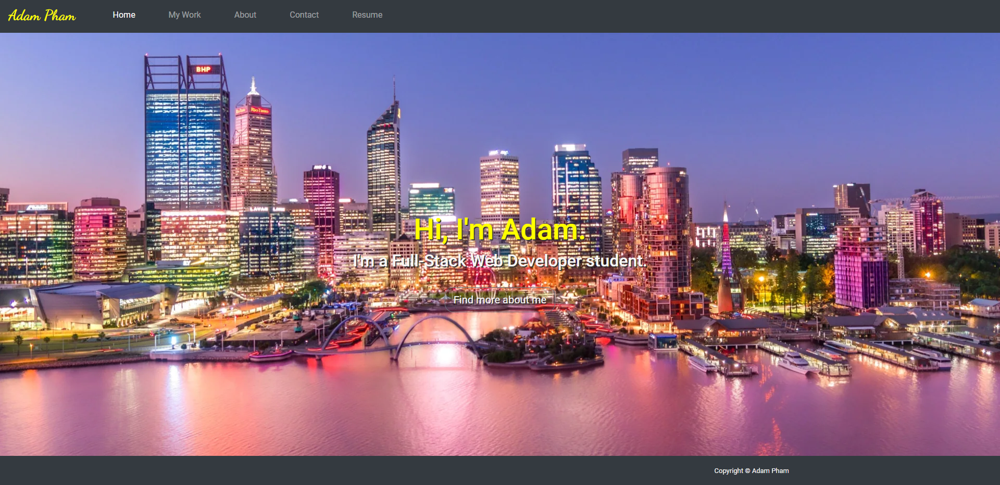

<h1 align="center">Welcome to my Portfolio Page 👋</h1>
<p align="center">
  <a href="https://github.com/ThiHoangPham/updated-portfolio-page-adam-homework8">
  
  <a href="https://github.com/ThiHoangPham/updated-portfolio-page-adam-homework8">
  
  <a href="https://github.com/ThiHoangPham/updated-portfolio-page-adam-homework8">
  
  
  <a href="https://github.com/ThiHoangPham/updated-portfolio-page-adam-homework8">
  
  <br>
  <a href="https://www.buymeacoffee.com/adampham123">
  
  <a href="https://github.com/ThiHoangPham/updated-portfolio-page-adam-homework8">
  
  <a href="https://github.com/ThiHoangPham/updated-portfolio-page-adam-homework8">
  
  <a href="https://github.com/ThiHoangPham/updated-portfolio-page-adam-homework8">
  
  </a>
  <a href="https://github.com/ThiHoangPham/updated-portfolio-page-adam-homework8">
  
  <a href="https://github.com/ThiHoangPham/updated-portfolio-page-adam-homework8">
  
  </a>
  <a href="https://github.com/ThiHoangPham/updated-portfolio-page-adam-homework8">
  
  </a>
  <a href="https://github.com/ThiHoangPham/updated-portfolio-page-adam-homework8">
  
  </a>
  <a href="https://twitter.com/AdamThaiHoang1">
  
  </a>
</p>

# Project Name: Professional Materials

## Description:
Updated portfolio page and other materials to build toward being employer-competitive.

## Tasks:

```
## Updated Portfolio

💁 Your updated portfolio should:

1. Display your contact information.
2. Have links to your GitHub profile and LinkedIn profile
3. Have a link to a downloadable PDF of your resume
4. Display at least 2 examples of student work from either deployed projects or homeworks.
5. Have a polished, mobile-responsive user interface.

### Design

* Mobile-first design
* Choose a color palette for your site so it doesn't just look like the default bootstrap theme or an unstyled HTML site.
* Make sure the font size is large enough to read, and that the colors don't cause eye strain.

## Updated GitHub Profile 

Your GitHub profile must contain at least the following items:

1. Profile picture or avatar
  * A photo or an avatar other than the default Github identicon.
2. Biography
3. Email address.
4. Link to your deployed portfolio
5. At least 2 pinned repositories:
	* Navigate to [GitHub](https://github.com/) and go to your profile.
	* Click "Customize your pins"
	* Click the checkboxes for your project and 2-3 homework assignments that you would like to share
6. Follow a few of your classmates and/or other developers. They are the beginning of your professional network and being a developer is as much about being a part of the community as it is writing code.
7. README files. Every pinned project should contain a README file with:
	* Title of app
	* Live link to deployed app
	* List of technologies used
	* 1-2 sentences explaining what the app is
	* 2-3 Screenshots / gifs of the app
	* License (usually MIT)
	* Contact information for you and any collaborators
8. Commit history.

## Updated Resume 

💁 Submit a clear, concise, and compelling resume, tailored to the type of job you’re looking for.

Your resume should include:
* a heading with your name, phone number, professional email address, links to LinkedIn, portfolio and GitHub.
* a technical skills section, with all programming languages and technologies listed
* 3 of your strongest projects/homework assignments with brief description, languages used, and URL

## Updated LinkedIn

💁 Update your LinkedIn Profile with a strong bio statement, a professional photo, and links to your Github and portfolio.
```
## Table of Contents:
- [Description](#description)
- [Tasks](#tasks)
- [Contributor](#contributor)
- [Contribution](#contribution)
- [Contact Information](#contact-information)
- [Live Demo](#live-demo)

## Contributor:
<a href="https://github.com/ThiHoangPham">
  
  </a>

## Contribution:
Please email to me if you have any contribution, I am more than happy with that. Thank you!

## Contact Information:

Github: [Thai Hoang(Adam), Pham](https://github.com/ThiHoangPham)

Email: thaihoangpham2008@gmail.com

## Live Demo: [Click Here!](https://thihoangpham.github.io/updated-portfolio-page-adam-homework8/index.html)

<p align ="right"><a href="#">↥ back to top</a></p>

- - -

© 2021 ThiHoangPham: Professional Materials